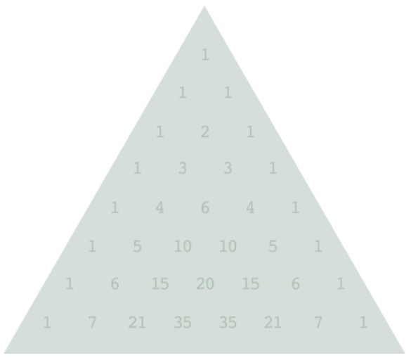

## 파스칼의 삼각형

##### for 650  points

##### pwnned by 0

위 그림은 n=0부터 n=7까지의 행을 가진 크기가 8인 파스칼의 삼각형을 나타낸 것이다.
삼각형의 세 꼭짓점을 각각 A, B, C 라 하고, A를 0번째 행으로 정하여 키보드로부터 행과 열을 
입력받는다.
각각의 꼭짓점을 0번째 행으로 하였을 때, 입력받은 위치에 존재하는 원소의 값들의 합을 구하는
프로그램을 작성하라.
예를들어 삼각형의 크기를 8, 행을 6, 열을 2라 하면 A를 기준으로 한 위치의 값은 15가 되고,
B를 기준으로 한 값은 3, C를 기준으로 한 값은 5가 되어 합은 23이 된다.

입력 : 첫째줄에 테스트 케이스의 개수 T(1<=T<=10)를 입력받는다.
이후 각각의 테스트 케이스에는 삼각형의 크기 n과 행 x, 열 y가 공백을 두고 입력받는다.
(1<=y<=x<=n<=1000)

출력 : 각각의 값을 더한 값을 1,000,000,007로 나눈 나머지를 출력한다.
각 출력은 명시되지 않은 \n이 있다.

입력 예시)
2
8 6 2
7 4 2

출력 예시)
Case 1
23
Case 2
18
